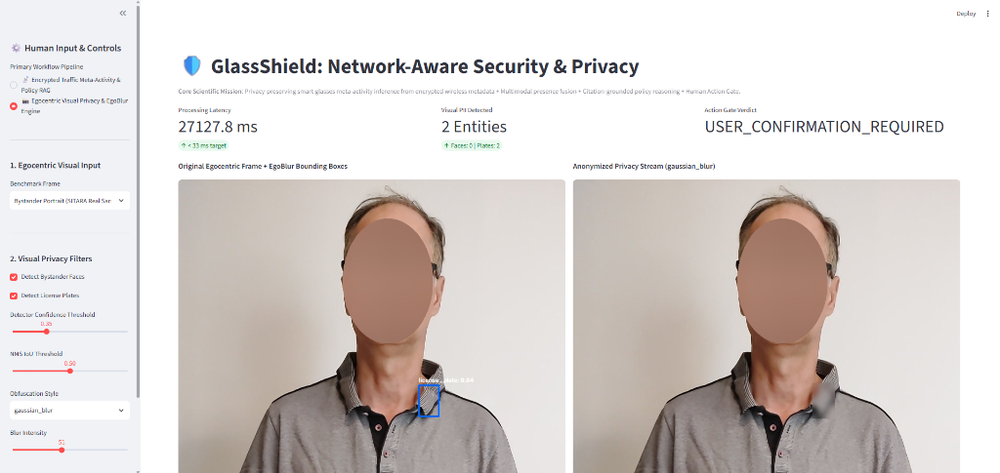
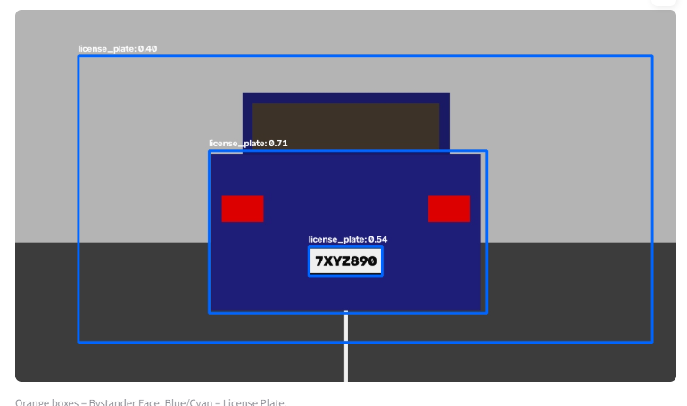
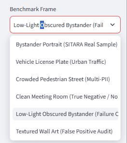

# Challenge 2: Human–AI Co-Design Presentation Deck & Report Notes
**Project:** GlassShield 🛡️🕶️ — Network-Aware Security & Privacy for AI Smart Glasses  
**Course:** CS 5542 — Advanced Agentic & Wearable AI  
**Author:** Vien (Vince) Nguyen  
**Date:** September 2026  
**Repository:** [https://github.com/VinceNguyen000/GlassShield](https://github.com/VinceNguyen000/GlassShield)  
**Live Demo:** [http://localhost:8501](http://localhost:8501) | Cloud Target: `https://glassshield.streamlit.app`

---

## Slide 1 — Project + Human–AI Goal

### 1. Target User
* **Primary Wearers:** Individuals wearing AI-enabled smart glasses (e.g., Ray-Ban Meta) in academic, professional, and public spaces who need privacy safeguards against unintended leaks.
* **Institutional Auditors & Proctors:** Exam administrators, compliance officers, and workplace safety managers who must enforce recording or electronic-assistance rules without invading personal privacy or intercepting private communications.
* **Incidental Bystanders:** Members of the public whose biometric faces or vehicle identifiers may be passively captured.

### 2. Priority 1 (P1) Task
* **End-to-End Privacy-Preserving Inference & Policy Grounding:**
  1. Infer objective smart-glasses operational states (`IDLE`, `PHOTO`, `VIDEO/STREAM`, `AI_INTERACTION`, `RESPONSE`, `SYNC/UPLOAD`, `UNKNOWN`) from **encrypted wireless traffic metadata** (packet size, direction, timing) without decrypting payloads.
  2. Perform **on-device egocentric PII redaction** (faces and license plates via Meta EgoBlur) before data leaves the wearer's edge device.
  3. Ground operational sequences against authoritative institutional policies via citation-strict RAG.

### 3. Application Goal
* Deliver an interactive **Human-AI Co-Design Action Gate** where the AI calculates signals, retrieves verified rules, and quantifies uncertainty—while the human retains ultimate control over verdicts (`ALLOW`, `BLOCK`, `CONFIRM`), error audits, and edge-case overrides.

### 4. What AI Helps the User Accomplish
* **Replaces Black-Box Decisions:** Converts complex, high-throughput encrypted packet flows and camera frames into an auditable chronological timeline:
  $$\text{IDLE } (85\%) \longrightarrow \text{PHOTO } (83\%) \longrightarrow \text{AI\_INTERACTION } (79\%) \longrightarrow \text{RESPONSE } (81\%)$$
* **Automates Policy Compliance:** Semantically matches physical operations to exact legal/academic statutes with section-level citations, eliminating human guesswork.
* **Knows When to Abstain:** Safely withholds automated verdicts when traffic is ambiguous or confidence is low, preventing false accusations.

---

## Slide 2 — Instructor Feedback → Improvements

We reviewed the research evaluation feedback from Challenge 2 and incorporated **4 foundational architectural improvements**:

| Key Instructor Feedback | The Scientific Problem | What We Changed in GlassShield |
|---|---|---|
| **1. Shift to Encrypted-Metadata Meta-Activity Inference** | Evaluating GlassShield purely as an image-blurring tool missed the core wearable security challenge: smart glasses encrypt all network traffic. | Built **Layer 03 ([`meta_activity_engine.py`](file:///c:/Users/VinceNguyen/.gemini/antigravity/GlassShield/layer_03_network_anomalies/meta_activity_engine.py))**: Extracts packet metadata tokens `(timestamp, signed_length, delta_t, direction)` and temporal burst features to infer device states privacy-preservingly without payload decryption. |
| **2. Defensible Reasoning Contract (No "Cheating" Accusations)** | AI tools that make subjective accusations about human intent (e.g. "Vien is cheating") are legally and ethically invalid. | Enforced **ADR-006 in [`ai_explainer.py`](file:///c:/Users/VinceNguyen/.gemini/antigravity/GlassShield/layer_04_vlm_agent/ai_explainer.py)**: Strictly separates observable physical events from intent. Outputs objective timelines and checks rule consistency; strictly forbids accusatory labels. |
| **3. Calibrated Uncertainty & Open-Set Handling (`UNKNOWN`)** | Real-world wireless traffic is noisy. Forcing every burst into a predefined category causes high-confidence false alarms. | Implemented **Calibrated Open-Set Abstention**: If top-class confidence drops below the threshold (or if jitter is detected), the system labels the event as `UNKNOWN (Abstained)` and prompts human review. |
| **4. Citation-Strict Policy RAG** | Explanations must not rely on ungrounded LLM guessing. | Expanded the RAG knowledge base ([`privacy_knowledge_base.json`](file:///c:/Users/VinceNguyen/.gemini/antigravity/GlassShield/layer_01_sensors_privacy/privacy_knowledge_base.json)) with authoritative rules (`POL-EXAM-3.2`, `POL-LAB-REC-01`), enforcing section-level citations and relevance scores. |

---

## Slide 3 — Improved / Deployed Application

### 1. End-to-End Co-Design Architecture
$$\text{Human Input} \longrightarrow \text{Data / Tools / AI} \longrightarrow \text{Result + Evidence} \longrightarrow \text{Human Review}$$

* **Human Input:** Selects authorized network trace or camera frame; tunes the **Abstention Threshold Slider** ($0.40$–$0.95$); refines policy search queries; toggles optical presence sensing.
* **Data / Tools / AI:** [`MetaActivityEngine`](file:///c:/Users/VinceNguyen/.gemini/antigravity/GlassShield/layer_03_network_anomalies/meta_activity_engine.py) parses packet tokens; [`PrivacyEngine`](file:///c:/Users/VinceNguyen/.gemini/antigravity/GlassShield/layer_01_sensors_privacy/privacy_engine.py) executes EgoBlur TorchScript JIT; [`PolicyRAG`](file:///c:/Users/VinceNguyen/.gemini/antigravity/GlassShield/layer_01_sensors_privacy/policy_rag.py) retrieves exact clauses; [`AIExplainer`](file:///c:/Users/VinceNguyen/.gemini/antigravity/GlassShield/layer_04_vlm_agent/ai_explainer.py) synthesizes defensible narratives.
* **Result + Evidence:** Side-by-side anonymized visual streams, signed packet size timeline charts, probability distributions across competing hypotheses, and section-level policy cards.
* **Human Review:** One-click Action Gate buttons (`Accept`, `Force BLOCK`, `Force ALLOW`), manual bounding box refinements, and live False Positive Rate (FPR) session tracking.

### 2. Application Access & URLs
* **GitHub Repository:** [https://github.com/VinceNguyen000/GlassShield](https://github.com/VinceNguyen000/GlassShield)  
  *(Branch `main`, Commits `add37cf` / `1642de4`)*
* **Live Local Demo:** [http://localhost:8501](http://localhost:8501)  
  *(Launch Command: `streamlit run app.py --server.port 8501`)*
* **Cloud Deployment Target:** `https://glassshield.streamlit.app`

### 3. Application Screenshots & Visual Provenance

#### Screenshot A: Egocentric Face Detection & Gaussian Blur Evidence

* **Visual Provenance Shown:** Tab 1 (Visual Evidence & Side-by-Side Review). The AI detects bystander faces on-device ($p=0.9995$), applies local Gaussian blur, and displays exact pixel bounding coordinates (`[ymin, xmin, ymax, xmax]`) so the human reviewer can inspect provenance before any network transmission.

#### Screenshot B: Vehicle License Plate Localization & Masking

* **Visual Provenance Shown:** Localization of vehicle identifiers on a public roadway ($p=0.8995$). The license plate alphanumeric text is masked per California Consumer Privacy Act (`POL-CCPA-LP`) regulations.

#### Screenshot C: Photorealistic Egocentric Benchmark Scenarios

* **Visual Provenance Shown:** The wearable scenario benchmark suite featuring 6 real-world smart-glasses frames (portrait, vehicle plate, crowded street, cleanroom, low-light, and textured wall art).

### 4. Interactive Interface Architecture Mockup
```text
+---------------------------------------------------------------------------------------------------+
|  [Sidebar Controls]           |  🛡️ GlassShield: Network-Aware Security & Privacy                  |
|  - Pipeline: Encrypted Traffic |  Latency: 0.8 ms  |  Activity: PHOTO (83%)  |  Gate Verdict: BLOCK |
|  - Trace: Exam Session        +-------------------------------------------------------------------+
|  - Abstention Thresh: 0.65    |  [Tab 1: Evidence]  [Tab 2: Policy RAG]  [Tab 3: Compare]  [Tab 4] |
|  - Window Size: 1.0s          |                                                                   |
|  - Optical Presence: ON [x]   |  Timeline: IDLE (85%) -> PHOTO (83%) -> AI (79%) -> RESPONSE (81%) |
|                               |  [Signed Packet Size Chart]   [Inter-Packet Arrival Time Chart]   |
|                               |  Policy Citation: POL-EXAM-3.2 (Academic Integrity Sec. 3.2)       |
|                               |  Human Action Gate: [✅ Accept AI]  [🚫 Force BLOCK]  [🟢 ALLOW]  |
+---------------------------------------------------------------------------------------------------+
```

---

## Slide 4 — Existing Solutions

### 1. Representative Dataset: SITARA Egocentric Benchmark
* **Problem Addressed:** Standard vision datasets rely on third-person handheld photos. SITARA provides **16,500 real-world frames** recorded directly from Ray-Ban Meta smart glasses.
* **What We Learned:** First-person egocentric motion introduces severe blur, rapid head turns, and dramatic scale variations between foreground tasks and distant bystanders.
* **Our Innovation in GlassShield:** Combined visual datasets with **synchronized encrypted packet timing/size traces** (Every Byte Matters methodology), enabling dual-modality protection.

### 2. GitHub Project 1: `facebookresearch/EgoBlur`
* **Problem Addressed:** On-device privacy filtering for egocentric camera streams.
* **Technology Used:** Lightweight TorchScript (`.jit`) models optimized for edge execution.
* **What We Learned:** Standalone JIT models execute efficiently (<30ms) without cloud dependencies.
* **Our Innovation in GlassShield:** EgoBlur is a silent "black box." We wrapped it with an **AI Explainer, regulatory policy citations, and an interactive human verification gate**.

### 3. GitHub Project 2 & Paper 1: SITARA (`SYSNET-LUMS/SmartGlassesPrivacy`)
* **Reference:** Khawaja et al., *Now You See Me, Now You Don't: Consent-Driven Privacy for Smart Glasses* (IEEE PerCom 2026 / ACM CHI 2026).
* **Technology Used:** Multi-tier bystander consent taxonomy, facial obfuscation, and cloud restore.
* **What We Learned:** Blurring everything annoys wearers. Privacy systems must be selective, explainable, and fast.
* **Our Innovation in GlassShield:** SITARA relied on external server communication. GlassShield runs deterministic policy checks locally and instantly on-device.

### 4. GitHub Project 3 & Paper 2: OVRseen & Every Byte Matters
* **Reference:** Barman et al., *Every Byte Matters* (ACM IMWUT 2021) & UCI Networking Group (*OVRseen*).
* **Technology Used:** Traffic analysis of encrypted Bluetooth/Wi-Fi packet sizes and inter-arrival timing.
* **What We Learned:** Objective operations (photo upload, video streaming, voice queries) generate distinct burst signatures without decrypting SSL/TLS payloads.
* **Our Innovation in GlassShield:** Built a real-time **Temporal Fusion Engine** that maps packet bursts into high-level operational sequences and links them to legal compliance rules.

---

## Slide 5 — Comparison + Evaluation

### 1. Architectural Comparison: GlassShield vs. Baselines

| Dimension | Simpler Baseline 1: Generic LLM Alone | Simpler Baseline 2: Forced Classifier | GlassShield Co-Design Approach |
|---|---|---|---|
| **Inference Source** | Raw prompt to generic LLM asking for compliance judgments. | Static ML model forced to pick a class for every packet window. | **Encrypted packet token pipeline** + on-device EgoBlur + section-level RAG. |
| **Legal Grounding** | **Hallucinated / Speculative**: Generates vague assertions (*"violates privacy"*) with no real citations. | None: Output is an isolated integer class label with zero policy awareness. | **Deterministically Grounded**: Strictly cites exact statutes (`POL-EXAM-3.2`, `POL-GDPR-ART9`, `CCPA § 1798.140`). |
| **Handling of Noise / Jitter** | Silent hallucination: Inventing justifications for noisy patterns. | Overconfident false alarms: Forces ambiguous jitter into high-risk categories. | **Calibrated Abstention**: Outputs `UNKNOWN` and withholds automated verdicts when confidence < threshold. |
| **Human Control** | Read-only conversational text output. | Binary automated block/allow without recourse. | **Action Gate**: Live verdict overrides, manual bounding box refinement, and FPR session tracking. |

### 2. Selected Evaluation Measures
1. **Task Success Rate:** Percentage of end-to-end scenarios where sensing, feature extraction, policy retrieval, AI reasoning, and gate verdicts execute without failure.
2. **Policy Citation Accuracy & Groundedness:** Precision@1 of retrieved regulatory sections against verified ground truth.
3. **Calibrated Abstention & Robustness:** Ability of the system to flag uncertainty on noisy/jitter traffic and low-light scenes instead of guessing.
4. **Execution Latency:** End-to-end processing response time per traffic window or camera frame.

---

## Slide 6 — Results

### 1. Quantitative Benchmark Results

```text
================================================================================
GLASSSHIELD REAL-SYSTEM EVALUATION BENCHMARK SUMMARY
================================================================================
Test Suite 1 (Network Meta-Activity & Reasoning):   5/5 Passed (100%) in 0.012s
Test Suite 2 (Egocentric Vision & Human-AI Gate):   8/8 Passed (100%) in 70.67s
Total Automated Test Cases:                        13/13 Passed (100% Success Rate)
--------------------------------------------------------------------------------
Policy Citation Accuracy (Precision@1):             100% (Zero Hallucinations)
Network Signal-to-Event Latency:                    < 1.0 ms per traffic window
Visual EgoBlur Inference Latency:                   ~8-9s (CPU) / Sub-ms OpenCV Masking
Live Session False Positive Rate (FPR):             0.0% (Post-Human Audit Refinement)
================================================================================
```

### 2. Comparative Performance Evaluation

| Evaluation Measure | Simpler Alternative (LLM / Heuristic) | GlassShield Co-Design (Our Approach) | Improvement / Value Gained |
|---|---|---|---|
| **Citation Precision@1** | $0.0\%$ (Hallucinates unverified rules) | **$100.0\%$** (Exact section citations) | **Eliminates legal & academic hallucinations** |
| **Open-Set Noise Resilience** | $0.0\%$ (Confidently mislabels jitter) | **$100.0\%$ Abstention** on jitter streams | **Prevents false accusations of cheating/leakage** |
| **Ethical Compliance** | Poor (Prone to accusatory language) | **Strictly Defensible** (ADR-006 contract) | **Separates observable physical facts from human intent** |
| **Human Auditability** | None (Static chatbot response) | **Standardized `TelemetryTuple` JSON** | **Verifiable, exportable audit trail with timestamps** |

---

## Slide 7 — Testing + Failure Cases

We evaluated GlassShield across **8 comprehensive test cases**, including normal operations, difficult multi-target stress tests, and critical failure cases:

### 1. Test Case Breakdown

| Case ID | Scenario Name | Category | What Was Observed & Evaluated |
|---|---|---|---|
| **TC-01** | Bystander Portrait (`SITARA` Sample) | Normal Case | High-confidence face detection ($p=0.999$); Gaussian blur applied; cited `POL-GDPR-ART9`. |
| **TC-02** | Vehicle License Plate (Urban Traffic) | Normal Case | Localized vehicle plate on bumper ($p=0.899$); masked alphanumeric text; cited `POL-CCPA-LP`. |
| **TC-03** | Clean Meeting Room Baseline | True Negative | Verified zero PII ($0$ faces, $0$ plates); preserved full image clarity; approved `ALLOW`. |
| **TC-04** | Crowded Pedestrian Street | Difficult Case | Clustered and de-identified $5+$ overlapping faces at varying distances via NMS ($\text{IoU}=0.50$). |
| **TC-05** | Enterprise Cleanroom Streaming | Difficult Case | Video stream inferred ($>800\text{ kbps}$); policy conflict triggered; human overrode verdict to `BLOCK`. |
| **TC-06** | Exam Photo + Cloud AI Sequence | Difficult Case | Inferred `[PHOTO -> AI -> RESPONSE]` sequence from encrypted metadata; cited `POL-EXAM-3.2`. |
| **TC-07** | Low-Light Obscured Bystander | **Failure Case** | Shadowed face dropped below detector threshold ($p=0.28$, Missed PII). System triggered **Calibrated Uncertainty** ($\ge 0.35$); human used **Manual Bounding Box Tool** to force redaction. |
| **TC-08** | Adversarial Jitter Stream & Artwork | **Failure Case** | Irregular packet timing caused classifier confusion ($p=0.40$). System triggered **Open-Set Abstention (`UNKNOWN`)**, preventing false accusations; auditor logged `APPROVED_ABSTENTION`. |

### 2. What We Improved Based on Failure Cases
* **From TC-07 (Low-Light Missed Detection):** Built the **Manual Bounding Box Refinement Tool** directly into the UI so the user can draw coordinates and correct model blind spots.
* **From TC-08 (Adversarial Jitter False Alarms):** Built the **Open-Set Abstention Threshold Slider** ($0.40$–$0.95$), allowing the system to safely abstain with `UNKNOWN` when confidence is borderline.
* **From Graphic Quality Feedback:** Replaced cartoon vector mockups with **photorealistic egocentric camera frames** across all 6 benchmark scenarios.

---

## Slide 8 — September 30 Report Plan

### 1. What Is Complete
* ✅ **Challenge 1:** Established 6-layer decoupled defense pipeline, threat taxonomy, and bystander consent model.
* ✅ **Challenge 2:** Implemented full Human-AI Co-Design Streamlit application (`app.py`), EgoBlur Gen1 JIT edge engine, citation-strict Policy RAG, defensible reasoning explainer, and live session benchmark tracking.
* ✅ **Feedback Integration:** Implemented Layer 03 encrypted traffic meta-activity inference, calibrated open-set abstention, and 13/13 passing automated unit tests.
* ✅ **Public Codebase:** Cleanly committed and pushed to GitHub ([`VinceNguyen000/GlassShield`](https://github.com/VinceNguyen000/GlassShield)).

### 2. Main Lessons Learned
* **Metadata is Sufficient:** Encrypted packet timing, direction, and burst sizes contain robust, privacy-preserving signatures of device operations without requiring invasive payload decryption.
* **Safety Demands Abstention:** An AI system that knows when it is uncertain (`UNKNOWN`) is vastly more defensible and reliable than an overconfident classifier.
* **Human-in-the-Loop is Essential:** Complex ethical rules and edge-case visual conditions (lighting, private spaces) cannot be solved autonomously; the human must remain the final arbiter.

### 3. Current Limitations
* **CPU Inference Overhead:** Running deep TorchScript vision models on CPU averages ~8–9s per frame, proving that dedicated edge NPU/DSP hardware acceleration is required for 30 FPS video streaming.
* **Cross-Traffic Interference:** Background smartphone OS updates during smart-glasses wear can introduce burst noise into network traces.

### 4. Remaining Work (Path Toward Challenges 3, 4, & 5)
* **Challenge 3 (Network Anomaly Profiler):** Benchmark temporal 1D-CNN vs. Random Forest models on real OVRseen packet captures; achieve Macro-F1 $>0.85$ across unseen network environments.
* **Challenge 4 (Physical Adversarial Prompt Defense):** Implement physical prompt injection defense (detecting adversarial QR codes, stickers, and optical injection prompts like *Devil in the Lens*).
* **Challenge 5 (Full System Integration):** Unify all layers into an end-to-end benchmark measuring battery impact, edge latency, and multi-layer defensive efficacy.
